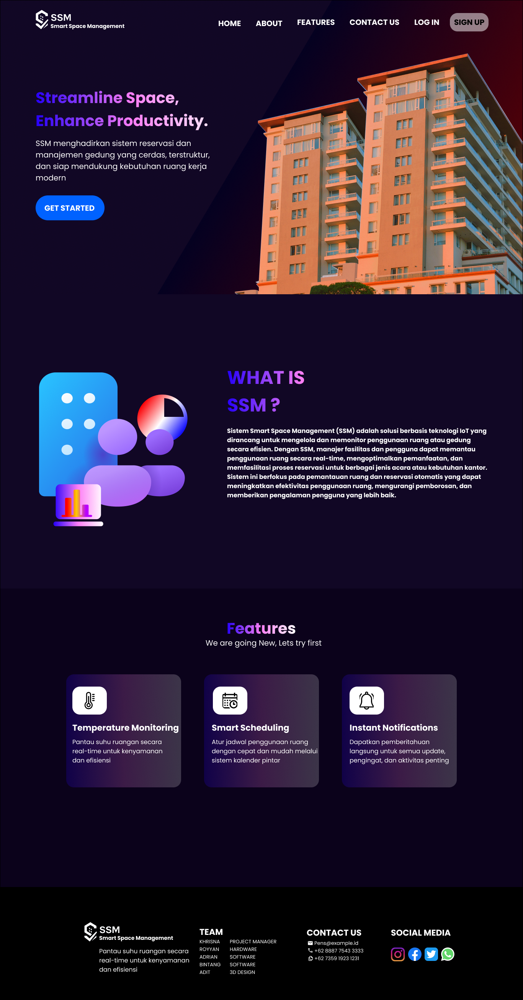
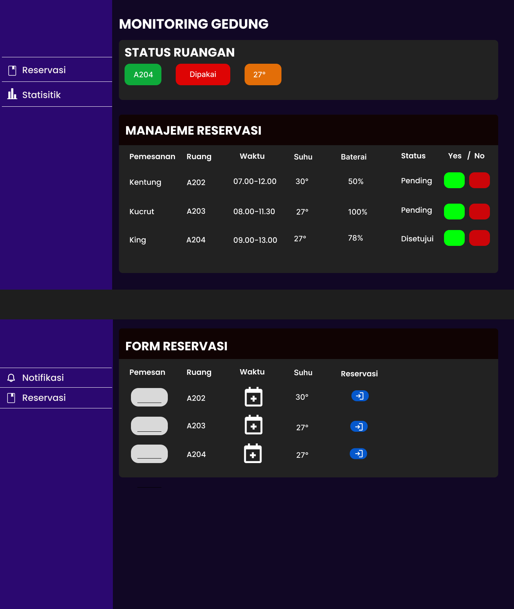

# 
# 
# 
## Streamline Space, Enhance Productivity. 

#### SSM menghadirkan sistem reservasi dan manajemen gedung yang cerdas, terstruktur, dan siap mendukung kebutuhan ruang kerja modern

## WHAT IS SSM ?

#### Sistem Smart Space Management (SSM) adalah solusi berbasis teknologi IoT yang dirancang untuk mengelola dan memonitor penggunaan ruang atau gedung secara efisien. 
#### Dengan SSM, manajer fasilitas dan pengguna dapat memantau penggunaan ruang secara real-time, mengoptimalkan pemanfaatan, dan memfasilitasi proses reservasi untuk berbagai jenis acara atau kebutuhan kantor. 
#### Sistem ini berfokus pada pemantauan ruang dan reservasi otomatis yang dapat meningkatkan efektivitas penggunaan ruang, mengurangi pemborosan, dan memberikan pengalaman pengguna yang lebih baik. 

## Temperature Monitoring 
#### Pantau suhu ruangan secara real-time untuk kenyamanan dan efisiensi 

## Smart Scheduling 
#### Atur jadwal penggunaan ruang dengan cepat dan mudah melalui sistem kalender pintar 

## Instant Notifications 
#### Dapatkan pemberitahuan langsung untuk semua update, pengingat, dan aktivitas penting 

## Alur Kerja dashboard admin 
#### menolak/menerima reservasi 
#### melihat baterai & suhu ruangan 
#### melihat statistik reservasi 

## Alur Kerja Pemesanan 
#### mengisi nama  
#### mengisi date and time  
#### bisa melihat ruang full/tidak , suhu ruangannya bagaimana  
#### pemesan akan menerima feedback berupa qr untuk diserahkan saat ada di tempat  

